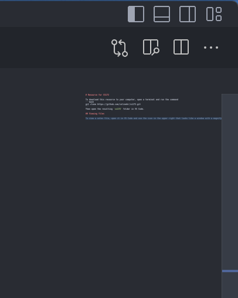

# Resource for CS172

To download this resource to your computer, open a terminal and run the command
```bash
git clone https://github.com/colinehr/cs172.git
```
Then open the resulting `cs172` folder in VS Code.

## Viewing files


