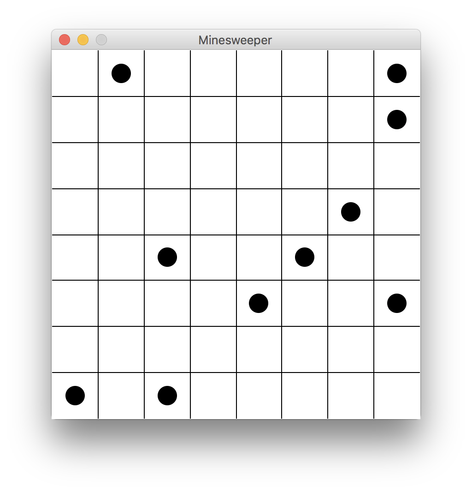

# Assignment: Minesweeper

This is our first longer project in CS172! We will develop this project in and out of class over the course of the next week or so. This document will be updated each class period with what to do next, and example code is given.

Minesweeper is a game that is well-known due to its inclusion in all Windows versions. For more information about the game and how it is played, see [the Minesweeper Wikipedia article](https://en.wikipedia.org/wiki/Minesweeper_(video_game)).

## Day 1: Displaying the Grid

Our first goal is to get a window that looks something like this:  Sample code is given in the `code/minesweeper.py` file. Your first goal is to:
1. Initialize a graphics window and draw an evenly spaced 8x8 grid.
2. The minefield will be represented in data as a two-dimensional list of strings; the initialization of this 2D list has already been written in the example. Randomly change 10 of the elements of `minefield` into `"*"` to represent 10 mines. **Be careful!** Make sure that 10 mines will actually be placed! Run your code multiple times with `print(minefield)` at the end and visually check that there are actually 10 mines each time you run it.
3. **Bonus.** Iterate through the `minefield` array and display the mines as circles as shown in the picture. (We will do this together on Wednesday, but you can try to do it first.)

Try to make these happen in your own code by **Wednesday**. You do not need to turn it in, but we will keep working on it and I will assume the first two steps have been finished.