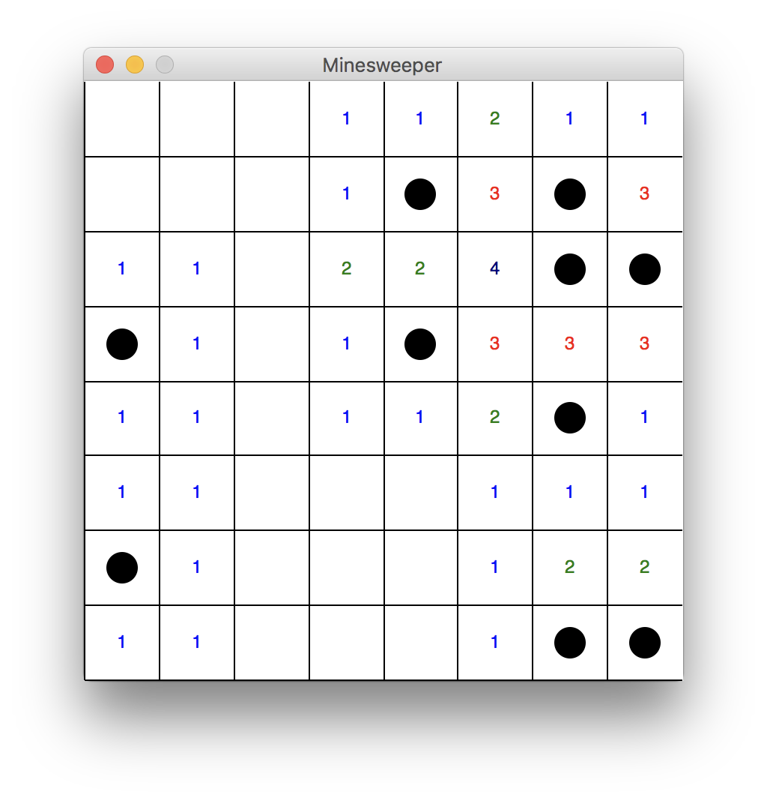

# Assignment: Minesweeper

This is our first longer project in CS172! We will develop this project in and out of class over the course of the next week or so. This document will be updated each class period with what to do next, and example code is given.

Minesweeper is a game that is well-known due to its inclusion in all Windows versions. For more information about the game and how it is played, see [the Minesweeper Wikipedia article](https://en.wikipedia.org/wiki/Minesweeper_(video_game)).

## Day 1: Displaying the Grid

Our first goal is to get a window that looks something like this:  Sample code is given in the `code/minesweeper.py` file. Your first goal is to:
1. Initialize a graphics window and draw an evenly spaced 8x8 grid.
2. The minefield will be represented in data as a two-dimensional list of strings; the initialization of this 2D list has already been written in the example. Randomly change 10 of the elements of `minefield` into `"*"` to represent 10 mines. **Be careful!** Make sure that 10 mines will actually be placed! Run your code multiple times with `print(minefield)` at the end and visually check that there are actually 10 mines each time you run it.
3. Iterate through the `minefield` array and display the mines as circles as shown in the picture. (We will do this together on Wednesday, but you can try to do it first.)

Try to make these happen in your own code by **Wednesday**. You do not need to turn it in, but we will keep working on it and I will assume the first two steps have been finished.

## Day 2: Calculating Adjacency Data

Our goal is to calculate the number of mines adjcent to each square (that is, how many mines are in the 9x9 square centered on it) and draw that information. It will look something like this: 

4. Write a program called `neighbor_mines` which takes our minefield and a row and column and returns how many mines are in the 9x9 square around `minefield[row][col]`. The function signature will be something like this:
```python
def neighbor_mines(minefield: list[list[str]], row: int, col: int) -> int:
    ...
```
(Why does `minefield` have the type `list[list[str]]`?) This is a somewhat tricky function and there are multiple ways to do it! Note that from here on out I may give tips in class with how to write the code assigned, but I *may not give any specific code examples in notes or in class*, since it's your job to write the code!
5. Use your `neighbor_mines` function to change each element in `minefield` that *isn't* `"*"` to a string representing how many mines are adjacent to that spot (for example `"0"`, `"1"`, `"2"`, etc.).
6. Learn how to use the `graphics.Text` object to draw the number of mines adjacent to each square; it should look something like the above picture, maybe without the fun colors (although feel free to experiment!).

Try to make these happen in your own code by **Friday**. You do not need to turn it in, but we will keep working on it and I will assume the first two steps have been finished.

## Day 3: Click to Reveal

Our goal is to make an interface for playing the game. Rather than display all of the information, we hide it from the user and make them click each square to reveal it.

I've included a sample application that you can play. To do so, open the `cs172` folder in VS Code, open the built-in terminal, and run the command
```
python3 assignments/mines.pyc
```

7. Hide the contents of the grid initially, and draw the appropriate text or circle only when the user clicks on that square. To wait for the user to click a square and get the coordinates of where they clicked, use the code
```python
click = win.getMouse()
x = click.getX()
y = click.getY()
```
8. If the square has no mines around it, reveal the contents of every square around it. If any of those squares have no mines around them, continue that process. (*Note: this is hard but you should try it!*)