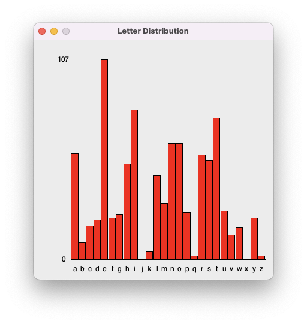

# Project: Letter Distribution

This is a pair programming project. Work with your assigned partner.
Only one of you has to turn it in, but make sure you don\'t both think
the other one was doing it.

## Overview

Write a program to count the distribution of letters in a text file. The
letter counts should be printed out and displayed as a bar chart. For
example, when run on the first paragraph of Herman Melville\'s novel
Moby Dick, it should print:

```
a: 57
b: 9
c: 18
d: 21
e: 107
f: 22
g: 24
h: 51
i: 80
j: 0
k: 4
l: 45
m: 30
n: 62
o: 62
p: 25
q: 2
r: 56
s: 53
t: 76
u: 26
v: 13
w: 17
x: 0
y: 22
z: 2
```

and draw precisely this diagram:



The program should work on any plain text file, with changing the
filename being the only modification needed to the code. You can test it
on these two files:

-   [para1.txt](para1.txt)
    (the first paragraph of Moby Dick, which should produce exactly the
    output above)

-   [2701-0.txt](http://www.gutenberg.org/files/2701/2701-0.txt)
    (the entire text of the novel)

## Hints

Here's a trick to easily convert the strings `'a'` through `'z'` to indices `0` through `25`:

```python
letters = "abcdefghijklmnopqrstuvwxyz"
letters.find("a")   # returns 0
letters.find("g")   # returns 6
letters.find("z")   # returns 25
```

You can save yourself a lot of math by adjusting the scale of the drawing window with:

```python 
win.setCoords(-5, 27, -0.1, 1.1)
```

This way, you can give `'a'` an x coordinate of 0, `'b'` an x
coordinate of 1, and so on. You will still need to scale the counts into
the 0.0 to 1.0 range by dividing by the maximum count.

## Rubric

- **Excellent (E):** The work exceeds the expectations of the assignment. Deep understanding of the concepts is evident. There are no nontrivial errors. Your code is readable, well-structured, and well-written. Code is cleanly divided into appropriately named functions, and input and output types for functions are given. Each function has a docstring written for it, and other more complicated parts of the code are explained with comments. This work could be used as an in-class example.
- **Meets Expectations (M):** Understanding of the concepts is evident. Code is correct and understandable. The logic of the code is broken up into functions, but some revision or expansion is needed. No additional instruction is needed.
- **Revision Needed (R):** Program appears to be mostly functional, but there may be some bugs still left in the code. The logic of the code is difficult to follow; there either aren't enough functions or the functions are not breaking up the code in a logical way. The code shows only partial understanding of concepts and needs further work or more review.
- **Not Assessable (N):** The code does not work or does not satisfy the program specification. There is not enough to accurately assess understanding of concepts and code writing ability. Or, there are simply too many mistakes to justify correcting each one separately.

## What To Hand In

Hand in your one file `letter_counter.py`.

Include your name and any other people you worked with in the `__author__` variable at the top of your code. For example, if I worked with Alain, the first line of my code would be
```python
__author__ = "Colin Ehr and Alain Kägi"
```
